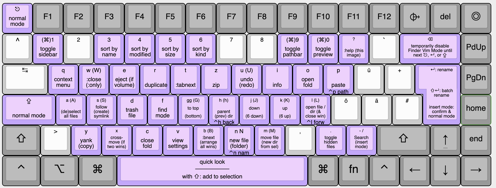

# Vim Mode for macOS Finder
Keyboard-only control of the Finder.app, inspired by vim/ranger. 



<!--toc:start-->
- [Usage](#usage)
- [Installations](#installations)
- [Updates](#updates)
- [Caveats](#caveats)
- [For Alfred users](#for-alfred-users)
- [Credits](#credits)
<!--toc:end-->

## Usage
- Only works in Finder's `List View`.
- Press `?` in Finder to show the cheatsheet above.

## Installations
- Install [Karabiner Elements](https://karabiner-elements.pqrs.org/).
- Run this in your terminal:

```bash
brew install karabiner-elements

open "karabiner://karabiner/assets/complex_modifications/import?url=https://github.com/chrisgrieser/finder-vim-mode/releases/latest/download/finder-vim.json"
curl -sL "https://raw.githubusercontent.com/chrisgrieser/finder-vim-mode/main/finder-vim-cheatsheet.png" -o "$HOME/.config/karabiner/assets/macos-finder-vim-mode.png"
```

## Updates
Karabiner has no mechanism for auto-updating its plugins. Therefore, you have to install updates manually by re-running the code above. You can watch the releases of this repo to be notified when there are updates.

## Caveats
Since Karabiner "plugins" are nothing more than (big) JSON files, the capabilities of this plugin are quite limited.
- Only List view is supported. 
- The desktop is not supported.
- It is impossible to have use a vimrc or to let the user configure the keybindings themselves in any way. If you want to rebind keys, you unfortunately have to change the respective key manually in the JSON file.
- If you have a other karabiner modification affecting the capslock key, it should come __after__ Finder Vim Controls in Karabiner's priority list to avoid conflicts.

## Build
Convert the YAML-File via [yq](https://github.com/mikefarah/yq):

```bash
yq -o=json 'explode(.)' finder-vim.yaml > finder-vim.json
```

## For Alfred users
Finder-Vim-Mode factors in the usage of Spotlight or Alfred with `cmd+space`. However, if you use another key combination with Alfred, for example for the clipboard or the Universal action, you have to use one of the following methods:

1. Temporarily pause Finder-Vim-Mode via `⌫ backspace`, and use Alfred. As soon as you press either `capslock`, `escape`, or `return`, Finder-Vim-Mode is active again.
2. (Recommended) Permanently disable Finder-Vim-Mode for the respective Alfred Commands by downloading the [Finder-Vim-Alfred-Addon](./finder-vim-alfred-addon.json) and customizing its keys. The `from` and `to` keys need to be the same (except for the extra intermediary `mandatory`), the first example uses modifier keys, the second only a single keystroke.
3. Enable "Compatibility Mode" in the Alfred Appearance options. Note that this might break certain Alfred workflow, which rely on this option being off.

<!-- vale Google.FirstPerson = NO -->
## Credits
Cheatsheet created with <http://www.keyboard-layout-editor.com/>

__About me__
In my day job, I am a sociologist studying the social mechanisms underlying the digital economy. For my PhD project, I investigate the governance of the app economy and how software ecosystems manage the tension between innovation and compatibility. If you are interested in this subject, feel free to get in touch.
