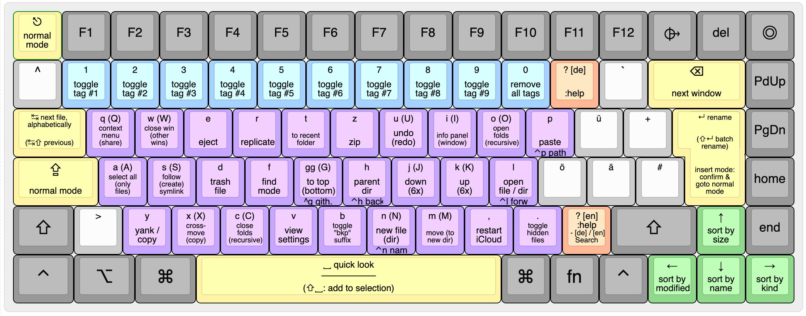

# Vim Mode for macOS Finder
Keyboard-only control for Finder, inspired by vim/ranger. 




<!--toc:start-->
- [Usage](#usage)
- [Installations](#installations)
- [Updates](#updates)
- [Caveats](#caveats)
- [Why not use a Terminal file manager?](#why-not-use-a-terminal-file-manager)
- [Build](#build)
- [Alfred and Raycast users](#alfred-and-raycast-users)
- [Credits](#credits)
<!--toc:end-->

## Usage
- Only works in Finder's `List View`.
- Press `?` in Finder to show the cheatsheet above, which shows all keys
supported by this plugin.
- __Move__: `m` marks the current selection as "to be moved." The next paste-operation `p` moves the files.
- __Cross-move__: If you have *exactly* two Finder windows open, `x` moves the selection to the other window, and `X` copies the selection to the other window.
- __Context-menu__: Can be opened with `q` and navigated via `hjkl`. Use `esc` or press `q` again to close the context-menu.
- __Find mode__ triggered via `f`, works similarly to `f` in vim, expecting another character afterward. For example, `fh` jumps to the next file, which starts with the letter `h`.
- __`-bkp` Toggle__: Add suffix `-bkp` to the file. If it already has such a suffix, remove it. Useful for debugging as well.
- __Open in GitHub__: If the file is in a git repo, `Ctrl+g` opens the file at GitHub and also copies the URL to the clipboard.
- ➡️ Consult the [vim help](https://vimhelp.org/) for the remaining ex-commands you are not familiar with.

> __Note__  
> You can "deactivate" the macOS Desktop via `defaults write com.apple.finder CreateDesktop false`. This way, `<BS>` (going to the next finder window) never focuses the desktop.

## Installations
- Install [Karabiner Elements](https://karabiner-elements.pqrs.org/).
- Run this in your terminal:

```bash
brew install karabiner-elements # Install Karabiner (if not already installed)
open "karabiner://karabiner/assets/complex_modifications/import?url=https://raw.githubusercontent.com/chrisgrieser/finder-vim-mode/main/finder-vim.json"
curl -sL "https://raw.githubusercontent.com/chrisgrieser/finder-vim-mode/main/finder-vim-cheatsheet.png" -o "$HOME/.config/karabiner/assets/finder-vim-mode-cheatsheet.png"
```

## Updates
Unfortunately, Karabiner has no mechanism for auto-updating its plugins. Therefore, you have to install updates manually by re-running the code above. You can check for the last commit date see whether there has been an update:


## Caveats
Since Karabiner plugins are only hotkey re-mappings without proper scripting mechanism, this plugin has some limitations:

### Major Caveats
- Only __List view__ is supported. The desktop is not supported.
- If you __use the mouse to click buttons__, you might end up in the wrong mode. In that case, Press `esc` to get back to Normal Mode. 
- If you __press `return` in a confirmation window__, for example when replacing a
file, you wrongly end up in Insert Mode. (Unfortunately, Karabiner is not able to detect whether the front window is a regular Finder window or a confirmation window). The workaround is to either press `esc` to go back to Normal Mode, or to use `tab` and `space` to select the correct action in the confirmation window.

### Minor Caveats
- File selection dialogues from other apps (for example, to upload a file in the browser) are not supported.
- This plugin has only been tested on the German QWERTZ keyboard layout and the standard US-QWERTY layout. There are probably some bugs with other layouts, if you stumble upon one, please open a bug report.
- Unfortunately, it is __not possible to have a `vimrc` or to let the user configure the keybindings__ themselves in any way, at least not with a Karabiner plugin. If you want to rebind keys, you have to change the respective key manually in the JSON file.
- If you have another Karabiner modification affecting the __Capslock__ key, it should come *after* Finder Vim Controls in Karabiner's priority list to avoid conflicts.

## Why not use a Terminal file manager?
Other than a nicer appearance, a GUI does have a few advantages like better operating-system-integration:
- Many apps have some way sort of `Reveal current file in Finder` feature, which is quite handy but does not work with a TUI file manager.
- With a GUI, you get a separate app in various places like the dock, the built-in app switcher (cmd+tab) or other app switchers (for example, `rcmd`). With a TUI, you'd have to switch to your Terminal, and then switch to your file manager via `tmux` etc., requiring basically an extra step
- Image previews and file content previews in an icon are not available with a TUI-file manager
- For some cases, drag-n-drop is still useful.
- Finder actually has some features like tags.
- A GUI allows you to have multiple windows open and work with them (for example, the x command in this plugin), while you cannot move files between two terminal windows, which ranger open?
- A bunch of automation apps for mac work with "if app x is frontmost" conditionals. With a TUI, those apps only see that your terminal is frontmost, but are mostly not able to tell what TUI is running inside the terminal.
- Cloud services (iCloud, Google Drive, Dropbox, etc.) indicate the file sync status of a file in Finder.

## Build
Karabiner plugins are essentially hotkey configurations in form of a JSON file. Since the amount of configurations for this plugin is rather large, the resulting JSON file has more than 6000 lines. To make that manageable, this plugin is written in YAML, where features such as anchors and aliases reduces the lines of code to only ~1000 lines.

If you want to fork this plugin, it is recommended to work with the YAML file and "compile" it to the [JSON required by Karabiner](https://karabiner-elements.pqrs.org/docs/json/complex-modifications-manipulator-definition/). You can do so with [yq](https://github.com/mikefarah/yq). (Note that the `explode()` is required to resolve the anchors and aliases.)

```bash
yq -o=json 'explode(.)' finder-vim.yaml > finder-vim.json
```

## Alfred and Raycast users
Finder-Vim-Mode factors in the usage of Spotlight, Alfred, or Raycast via `cmd+space`. However, if you use another key combination with Alfred, for example for the clipboard history or the Universal Action, you have to use one of the following methods:

1. Permanently disable Finder-Vim-Mode for the respective Alfred or Raycast Commands by downloading the [Finder-Vim-Alfred-Addon](./finder-vim-alfred-addon.json) and customizing its keys. The `from` and `to` keys need to be the same (except for the extra intermediary `mandatory`).
2. (Recommended) In [Alfred's Appearance Options](alfredpreferences://navigateto/appearance>[options]), set the `Focusing` behavior to `Compatibility Mode` . Note that this can affect triggers of the kind "if X is the frontmost app, then…" used by certain macOS automation apps.

## Credits
The cheatsheet has been created with <http://www.keyboard-layout-editor.com/>.

<!-- vale Google.FirstPerson = NO -->
__About Me__
In my day job, I am a sociologist studying the social mechanisms underlying the digital economy. For my PhD project, I investigate the governance of the app economy and how software ecosystems manage the tension between innovation and compatibility. If you are interested in this subject, feel free to get in touch.

__Profiles__  
- [Academic Website](https://chris-grieser.de/)
- [ResearchGate](https://www.researchgate.net/profile/Christopher-Grieser)
- [Discord](https://discordapp.com/users/462774483044794368/)
- [GitHub](https://github.com/chrisgrieser/)
- [Twitter](https://twitter.com/pseudo_meta)
- [Mastodon](https://pkm.social/@pseudometa)
- [LinkedIn](https://www.linkedin.com/in/christopher-grieser-ba693b17a/)

__Buy me a Coffee__  
<br>
<a href='https://ko-fi.com/Y8Y86SQ91' target='_blank'></a>
