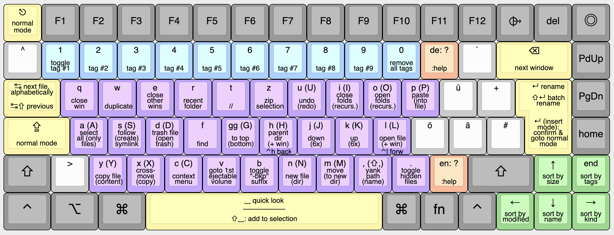

# Vim Mode for Finder
Feature-rich control of macOS Finder without the mouse, inspired by vim and ranger. 




## Usage Examples
- `rl`: Duplicate selected file and open the copy.
- `axw`: Select all files, move them to the other window, close current window.
- `.f.d.`: Show hidden files, select first hidden file, delete it, hide the files again.
- `AM`: Select files (but not folders), create a new directory, move selected files into that directory, and start renaming the directory (enters insert mode).
- `azmhp`: Select all files and folders, zip them, (wait for zipping to finish), and move the archive one directory up

## Table of Contents
<!--toc:start-->
- [Usage](#usage)
- [Installation](#installation)
- [Updates](#updates)
- [Caveats](#caveats)
- [Why not use a Terminal file manager?](#why-not-use-a-terminal-file-manager)
- [Build](#build)
- [Credits](#credits)
<!--toc:end-->

## Usage
- Only works in Finder's `List View`.
- __`:help`__ Press `?` in Finder to display the cheatsheet above.
- __Move__: `m` marks the current selection as "to be moved." The next paste-operation `p` moves the files. A move can be aborted via `esc`.
- __Cross-move__: If you have *exactly* two Finder windows open, `x` moves the selection to the other window, and `X` copies the selection to the other window.
- __Context-menu__: Can be opened with `q` and navigated via `hjkl`. Use `esc` or press `q` again to close the context-menu.
- __Find mode__ triggered via `f`, works similar to `f` in vim, expecting another character afterward. For example, `fh` jumps to the next file, which starts with the letter `h`.
- __Toggle `-bkp` suffix__: Add suffix `-bkp` to the file. If it already has such a suffix, remove it. Useful for debugging as well.
- __`Tab`__ goes to the next file in alphabetical order, *even when the view is not sorted alphabetically.* (This is actually a built-in feature of Finder, but probably worth pointing out since barely anyone knows about it.)
- __Open in GitHub__: If the file is in a git repo, `Ctrl+g` opens the file at GitHub and also copies the URL to the clipboard.
- __Batch Rename__ *(experimental)*: Rename with JavaScript-flavored Regex.
- __Marks & Multi-select__ *(experimental)*: Press `1` to (un)mark the current selection. Use `alt+space` to select all marked files in the current window. This way you can make non-continious selections without having to use `cmd+leftclick`.

## Installation
1. Run this in your terminal:

    ```bash
    brew install karabiner-elements # Install Karabiner (if not already installed)

    open "karabiner://karabiner/assets/complex_modifications/import?url=https://raw.githubusercontent.com/chrisgrieser/finder-vim-mode/main/finder-vim.json"
    curl -sL "https://raw.githubusercontent.com/chrisgrieser/finder-vim-mode/main/extras/cheatsheet.png" --create-dirs --output "$HOME/.config/karabiner/assets/finder-vim-mode/cheatsheet.png"
    curl -sL "https://raw.githubusercontent.com/chrisgrieser/finder-vim-mode/main/extras/batch-rename.js" --create-dirs --output "$HOME/.config/karabiner/assets/finder-vim-mode/batch-rename.js"
    ```

2. Activate the plugin: `Import` → `Enable`
3. *Karabiner users:* If you already use Karabiner and have another modification affecting the `Capslock` key, the other modification must come *below* the __Finder Vim Mode__ in the list of modifications. (Karabiner prioritizes modifications further on top of the list.) <!-- LTeX: enabled=false -->
4. *Alfred users:* <!-- LTeX: enabled=true -->In [the Appearance Options](https://www.alfredapp.com/help/appearance/#options), you need to set the `Focusing` behavior to `Compatibility Mode` for Karabiner to detect Alfred being active.
5. Open Finder, go the settings, create a tag named `vim-mark`, and move it to the *first* position in the list of tags. (This plugin basically re-purposes Finder's tag system to be used as (local) marks.)


## Updates
Unfortunately, Karabiner has no mechanism for auto-updating plugins. Therefore, you have to install updates manually by re-running the code above. You can check for the last commit date to see whether there has been an update:


## Caveats
Since Karabiner plugins are only hotkey re-mappings without proper scripting mechanism, this plugin has some limitations:
- Only __List view__ is supported. 
- __Pressing `return` in a prompt window__, for example when replacing a
file, mistakenly puts you in Insert Mode. (Unfortunately, Karabiner is not able to detect whether the front window is a regular Finder window or a prompt). The workaround is to either press `esc` to go back to Normal Mode, or to use `tab` and `space` to select the correct action in the prompt window.
- If you __use the mouse to click buttons__, you can end up in the wrong mode. In that case, you can press `esc` to get back to Normal Mode. (Or, you know, just do not use the mouse. You're a vim user, after all.)
- File selection dialogues from other apps (for example, to upload a file in the browser) are not supported.
- Unfortunately, it is __not possible to have a `vimrc` or to let the user configure the keybindings__ themselves in any way, at least not with a Karabiner plugin. If you want to rebind keys, you have to change the respective key manually in the JSON file.
- The plugin has been tested with the standard US and German keyboard layout. It should mostly also work for other layouts.
- Sometimes, usage of English as System UI language may solve an issue. (`System Settings → General → Language & Region → Preferred Languages`)

## Why not use a Terminal file manager?
Other than a nicer appearance, a GUI does have a few advantages:
- Many apps have some way sort of `Reveal current file in Finder` feature, which is quite handy but does not work with a TUI file manager.
- With a GUI, you get a separate app in various places like the dock, the built-in app switcher `cmd+tab`, or other app switchers (for example, `rcmd`). With a TUI, you'd have to switch to your Terminal, and then switch to your file manager, requiring basically an extra step.
- Image and file content previews as icons are not available with a TUI-file manager.
- Finder actually has many hidden features, which this plugin is utilizing.
- A bunch of automation apps for macOS work with "if app x is frontmost" conditions. With a TUI, those apps only see that your terminal is frontmost, but are mostly not able to tell what TUI is running inside the terminal.
- Cloud services (iCloud, Google Drive, Dropbox, etc.) are well-integrated with Finder.

## Build
Karabiner plugins are essentially hotkey configurations in form of a JSON file. Since the amount of configurations for this plugin is rather large, the resulting JSON file has more than 6000 lines. To make that manageable, this plugin is written in YAML, where features such as anchors and aliases [anchors and aliases](https://www.linode.com/docs/guides/yaml-anchors-aliases-overrides-extensions/) reduces the lines of code to only ~1000 lines.

If you want to fork this plugin, it is recommended to work with the YAML file and "compile" it to the [JSON required by Karabiner](https://karabiner-elements.pqrs.org/docs/json/complex-modifications-manipulator-definition/). You can do so with [yq](https://github.com/mikefarah/yq). (Note that the `explode()` is required to resolve the anchors and aliases.)

```bash
yq -o=json 'explode(.)' finder-vim.yaml > finder-vim.json
```

## Credits
- The cheatsheet has been created with <http://www.keyboard-layout-editor.com/>.
- The batch-renaming function is based [on code from dtinth](https://gist.github.com/dtinth/93e230152a771dcb1ec5).

<!-- vale Google.FirstPerson = NO -->
__About Me__  
In my day job, I am a sociologist studying the social mechanisms underlying the digital economy. For my PhD project, I investigate the governance of the app economy and how software ecosystems manage the tension between innovation and compatibility. If you are interested in this subject, feel free to get in touch.

__Profiles__  
- [Academic Website](https://chris-grieser.de/)
- [ResearchGate](https://www.researchgate.net/profile/Christopher-Grieser)
- [Discord](https://discordapp.com/users/462774483044794368/)
- [GitHub](https://github.com/chrisgrieser/)
- [Twitter](https://twitter.com/pseudo_meta)
- [Mastodon](https://pkm.social/@pseudometa)
- [LinkedIn](https://www.linkedin.com/in/christopher-grieser-ba693b17a/)

__Buy me a Coffee__  
<br>
<a href='https://ko-fi.com/Y8Y86SQ91' target='_blank'></a>
